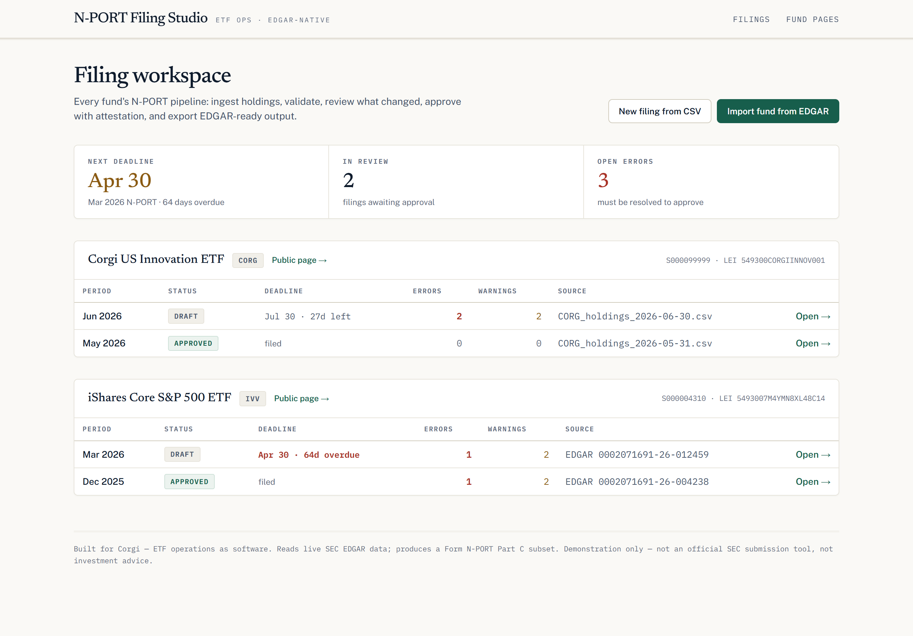
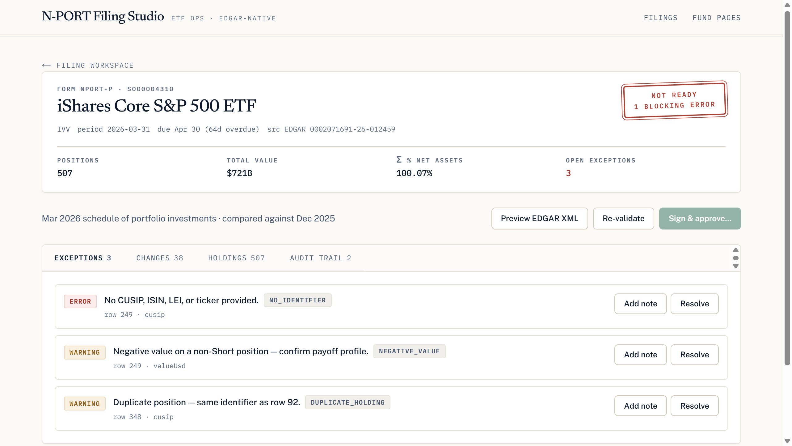
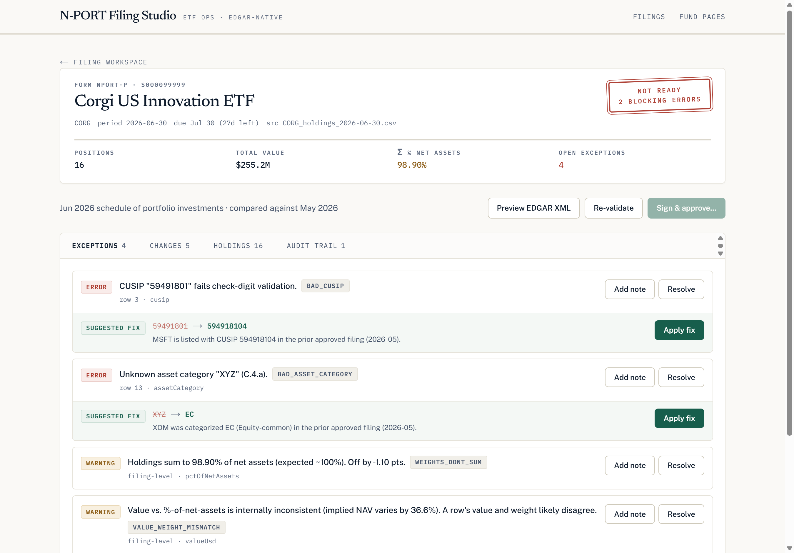
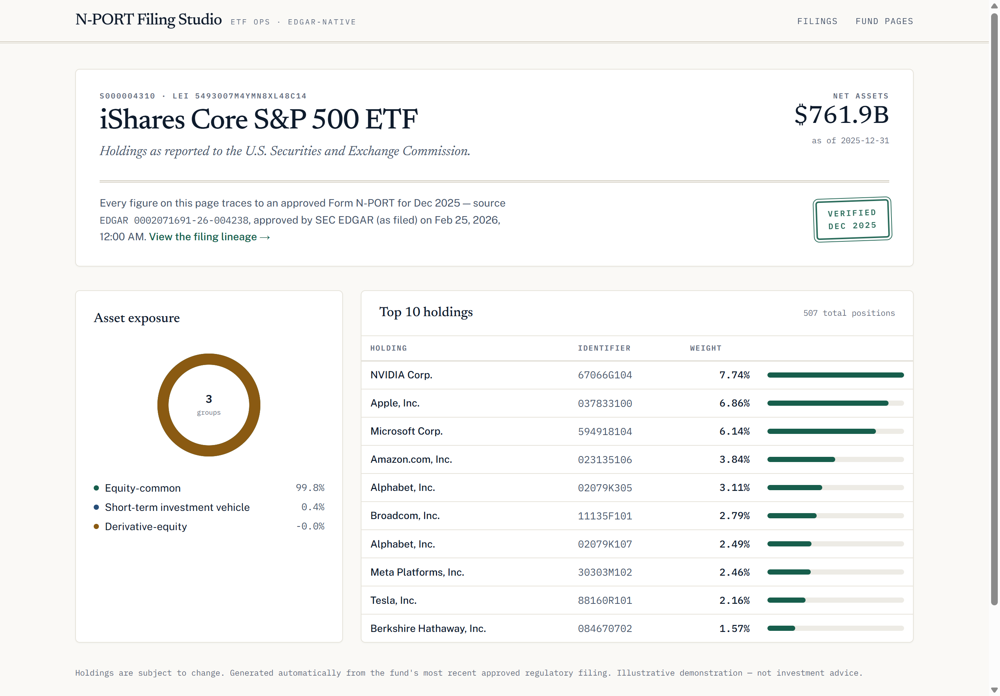

# N-PORT Filing Studio

**ETF operations as software.** Import any real ETF's holdings straight from SEC EDGAR, validate them against Form N-PORT rules, review what changed period-over-period, fix data defects with one click, sign off with an attestation — and publish a public fund page that only ever shows approved, audited data.

Built as a working answer to Corgi's application prompt: *"Demo a project that could help the team on day 1 — e.g. software to automate N-PORT filing."*



## The pipeline

```
SEC EDGAR / fund-admin CSV
        │  ingest (ticker → CIK → series filings → primary_doc.xml)
        ▼
   Rule engine ──────► Exception queue ──► Suggested fixes (one-click, audit-logged)
   (N-PORT field,          │
    check-digit,           ▼
    consistency)      Period diff vs. prior filing
                           │
                           ▼
                 Sign & approve (written attestation, error-gated)
                           │
                           ├──► EDGAR-ready N-PORT XML
                           └──► Public fund page (approved data only, with provenance)
```

Every state change — ingest, validation, fix, resolution, approval — lands in an append-only audit trail: **what changed, who did it, when, and why.**

## It runs on real regulatory data

Type `IVV` and the app resolves the ticker through EDGAR's fund registry, pulls the two most recent Form N-PORT filings for that *series* (a trust like iShares files hundreds), parses the XML, and loads them — the earlier as approved reference data, the latest into the review queue.

The validator found a real anomaly in BlackRock's actual $721B S&P 500 ETF filing — a duplicate CUSIP across two rows — and the period diff shows genuine index turnover (6 added / 6 removed / 26 reweighted for Mar 2026 vs. Dec 2025 — Vertiv and Ciena really did join the S&P 500). The rules are derivative-aware: futures and swaps legitimately carry no CUSIP, no investment country, and negative unrealized values, so those aggregate into one informational note instead of a wall of false positives.



## Suggested fixes: the leverage feature

Detecting a bad CUSIP is table stakes. The interesting part is doing what the analyst would do — **reconcile against the last approved filing** — automatically:

> `59491801` → `594918104` — *"MSFT is listed with CUSIP 594918104 in the prior approved filing (2026-05)."* **[Apply fix]**

One click applies the correction, writes a before→after audit event, and re-validates the filing. Three strategies ship today:

| Exception | Fix strategy |
|---|---|
| `BAD_CUSIP` | Prior-filing reconciliation, else check-digit repair from the 8-char stem |
| `BAD_ASSET_CATEGORY` | Prior-filing reconciliation (same security, last approved category) |
| `VALUE_WEIGHT_MISMATCH` | Find the outlier row via median implied NAV; recompute value from weight |

Approval is gated on zero unresolved errors, and the "Sign & approve" ceremony shows exactly what you're signing (positions, Σ weights, exceptions, period changes) and requires a written attestation that becomes part of the audit record.



## Public fund pages publish only approved data

The fund page renders exclusively from the most recent **approved** filing — never drafts. Every page carries its provenance: the source accession, who approved it, and when, with a link back to the filing's full lineage.



Lighthouse on the public pages: **100 accessibility · 100 best practices · 100 SEO**.

## Things I learned about N-PORT the hard way

- **`repPdEnd` is not the reporting period.** It's the fund's fiscal-year end and is identical across a year of filings; `repPdDate` is the actual as-of date. Mapping the wrong one silently collapses distinct periods into one.
- **Real filings use the literal string `"N/A"`** for missing LEIs, CUSIPs, names, and countries. Validate after normalizing, or you drown in false positives (16 of IVV's 18 initial warnings were this).
- **Derivatives break naive rules.** Vanguard's S&P 500 fund holds index futures that legitimately have no identifier, no country, and negative values — a validator that doesn't know that reports 50+ phantom findings on a perfectly good filing.
- **Diff on the most stable identifier.** Keying the period diff on CUSIP means a mistyped CUSIP shows up as a phantom add+remove; keying ticker-first keeps it a single validation error.
- **CUSIP/ISIN/LEI check digits are cheap and catch real errors** — mod-10 double-add-double, Luhn over digit expansion, and ISO 7064 mod-97-10 respectively. All 507 identifiers in the real IVV filing pass; a single transposed digit fails.

## Stack

TypeScript · Next.js 15 (App Router, server actions) · Drizzle ORM · PostgreSQL · Tailwind v4 · Biome · Resend (approval notifications) · `fast-xml-parser` for EDGAR documents.

Type system, from the subject's own world: **Newsreader** (display serif — the voice of a printed prospectus), **Public Sans** (the U.S. government's own typeface, for a tool that produces U.S. government filings), **IBM Plex Mono** (all data — EDGAR renders in monospace).

## Run locally

```bash
docker compose up -d        # Postgres 16 on port 5434
cp .env.example .env
npm install
npm run db:push             # apply Drizzle schema
npm run seed                # CORG fund: approved May filing + June draft with 3 fixable defects
npm run dev
```

Open http://localhost:3000 — then hit **Import fund from EDGAR** and type any ETF ticker (`IVV`, `SCHD`, `QQQM`…). A sample fund-admin CSV is at [`public/sample_holdings.csv`](public/sample_holdings.csv) for the upload path.

> SEC EDGAR asks for a descriptive `User-Agent`; set `SEC_USER_AGENT="YourApp/0.1 (you@example.com)"` in `.env`.

## Deploy

Vercel + any hosted Postgres (Neon works well — use the pooled connection string):

1. Set `DATABASE_URL`, `SEC_USER_AGENT`, and `CRON_SECRET` in Vercel env.
2. `npm run db:push` once against the hosted DB, then `npm run seed`.
3. `vercel.json` schedules a nightly `GET /api/reseed` (Bearer `CRON_SECRET`) that restores the demo state and re-imports IVV/SCHD from EDGAR.

## Honest scope

This is a demonstration, not a filing agent: it produces a faithful **subset** of Form N-PORT Part C (the schedule of portfolio investments), not the full ~200-field submission, and it does not submit to EDGAR. The workflow around it — validation, exceptions, evidence, approval, provenance — is the part built to production intent.
